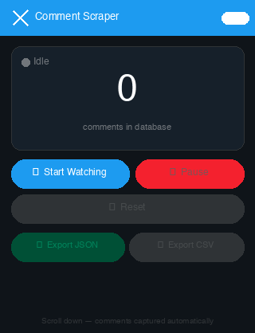

# X / Twitter Comment Scraper

> A vibe coded zero-dependency Chrome extension that passively collects every reply on any X (Twitter) post as you scroll. No API key, no cookies, no rate limits. For Free.

[](LICENSE)
[](manifest.json)
[](CONTRIBUTING.md)

<p align="center">
  
</p>

---

## How it works

X virtualises its feed: as you scroll down, old reply nodes are removed from the DOM and new ones are injected. A **`MutationObserver`** watches `document.body` and captures every `<article data-testid="tweet">` the moment it appears. Each capture is deduplicated by tweet ID before being written to an in-memory store, so the same reply is never counted twice no matter how many times you scroll past it.

```
User scrolls ──▶ X injects article nodes ──▶ MutationObserver fires
                                                      │
                                              ingest(article)
                                                      │
                                          tweetId in seen Map?
                                           yes ──▶ skip
                                           no  ──▶ parse & store
```

---

## Features

| | |
|---|---|
| 🔍 **Passive capture** | Works as you scroll. No auto-scroll bot |
| 🧹 **Deduplication** | Each comment stored exactly once (keyed by tweet ID) |
| ⏸ **Pause / Resume** | Stop the observer at any time; data is preserved |
| 🗑 **Reset** | Wipe the in-memory store and start fresh |
| ⬇ **Export JSON** | Full structured data, pretty-printed |
| ⬇ **Export CSV** | Spreadsheet-ready, all fields, UTF-8 |
| 🔒 **No external requests** | Everything runs locally in the browser |
| 📦 **No build step** | Plain HTML + JS, load directly as unpacked extension |

---

## Data collected per comment

| Field | Description |
|---|---|
| `tweetId` | Unique tweet snowflake ID |
| `tweetUrl` | Full permalink (`https://x.com/…/status/…`) |
| `displayName` | User's display name |
| `username` | `@handle` without the `@` |
| `isVerified` | Blue-verified badge (`true`/`false`) |
| `tweetText` | Full reply text |
| `timestamp` | ISO 8601 datetime (`datetime` attribute) |
| `timeFormatted` | Human-readable time as shown on screen |
| `replies` | Reply count on this comment |
| `retweets` | Repost count |
| `likes` | Like count |
| `bookmarks` | Bookmark count |
| `views` | View count |

---

## Installation

No build step required.

1. [Download the latest release ZIP](../../releases/latest) and unzip it  
   — or — clone this repo:
   ```bash
   git clone https://github.com/your-username/x-comment-scraper.git
   ```

2. Open Chrome and go to **`chrome://extensions`**

3. Enable **Developer mode** (toggle in the top-right corner)

4. Click **"Load unpacked"** and select the `x-comment-scraper-extension/` folder

5. The extension icon appears in your toolbar.

---

## Usage

1. Log in to [x.com](https://x.com) in Chrome
2. Open any post/tweet page (URL must contain `/status/`)
3. Click the extension icon
4. Press **👁 Start Watching**
5. Scroll down through the replies at your own pace
6. The counter updates live as new comments are captured
7. Click **⬇ Export JSON** or **⬇ Export CSV** at any time

> **Tip:** You can close the popup while watching — the observer keeps running in the background. Reopen the popup to check the count or export.

---

## File structure

```
x-comment-scraper-extension/
├── manifest.json          # Extension manifest (Manifest V3)
├── content.js             # MutationObserver scraper — injected into x.com pages
├── popup.html             # Extension popup UI
├── popup.js               # Popup logic — polls content script, handles exports
├── icons/
│   ├── icon16.png
│   ├── icon32.png
│   ├── icon48.png
│   └── icon128.png
├── assets/
│   └── demo.gif           # Animated demo (README)
├── scripts/
│   └── generate_assets.py # Regenerate icons + demo GIF
├── CONTRIBUTING.md
├── LICENSE                # MIT
└── README.md
```

---

## Permissions used

| Permission | Why |
|---|---|
| `activeTab` | Read the URL of the current tab to validate it's a tweet page |
| `scripting` | Programmatically inject `content.js` if the tab was open before install |
| `downloads` | Trigger file download for JSON/CSV export |
| `storage` | (Reserved for future persistent storage across sessions) |
| `host_permissions`: `x.com`, `twitter.com` | Allow the content script to run on these domains |

---

## Browser support

| Browser | Status |
|---|---|
| Chrome 109+ | ✅ Fully supported (Manifest V3) |
| Edge (Chromium) | untested |
| Firefox | ❌ Uses different extension APIs |
| Safari | ❌ Not supported |

---

## Contributing

Contributions are welcome! Please read [CONTRIBUTING.md](CONTRIBUTING.md) before opening a pull request.

---

## Disclaimer

This tool is intended for personal research and data analysis on **public** posts only. Use it responsibly and in accordance with [X's Terms of Service](https://twitter.com/en/tos). The authors are not responsible for misuse.

---

## License

[MIT](LICENSE) © 2026
